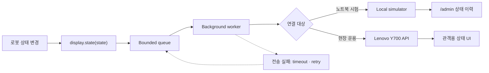
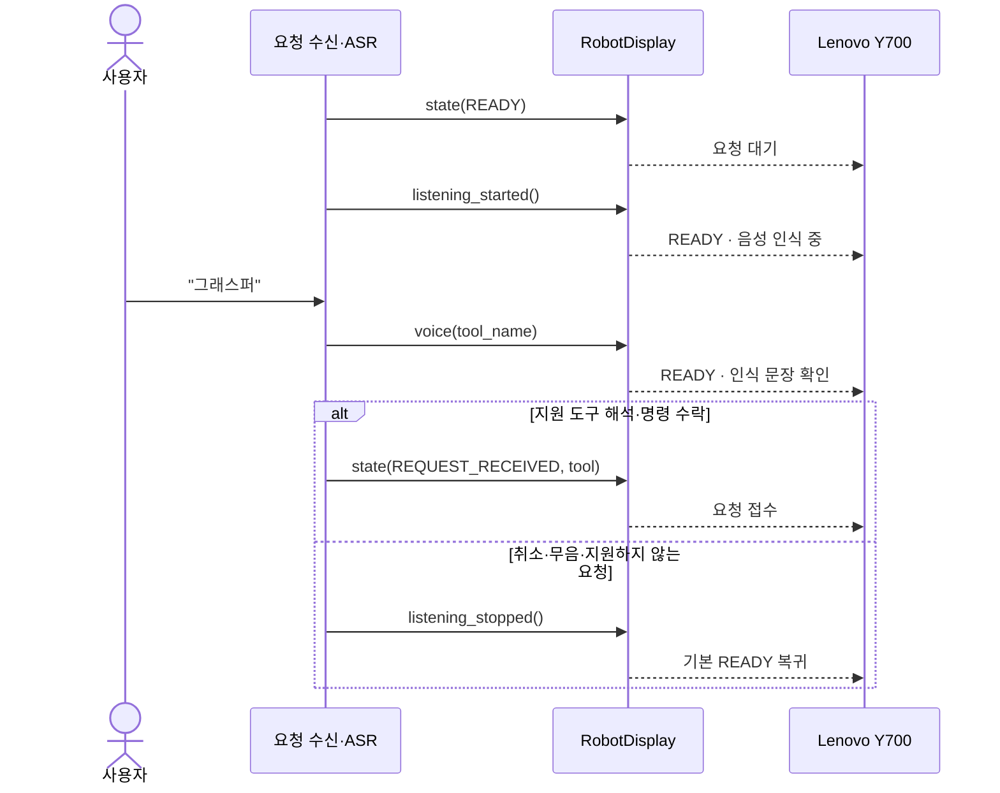
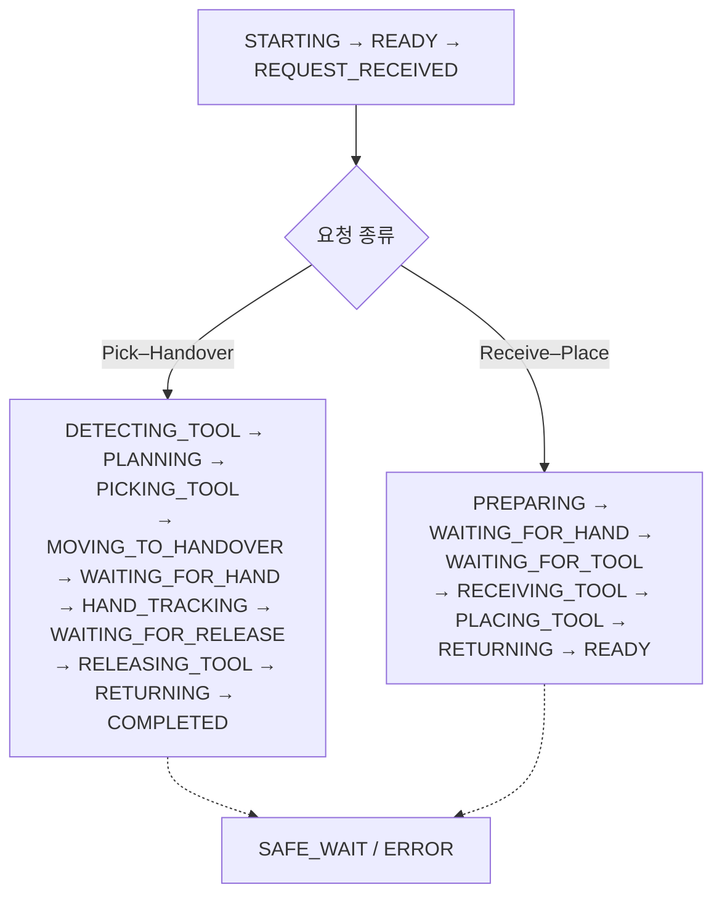

# Orchestra Display Integration

로봇 프로그램이 Orchestra Display에 상태를 보내기 위한 Python 클라이언트입니다.
Lenovo 태블릿이 없을 때 사용할 로컬 수신 서버도 포함합니다.

로봇 제어 코드와 Android 앱은 포함하지 않습니다.

## Overview

`display.state()`는 상태를 큐에 넣고 바로 반환합니다. HTTP 전송은 별도 작업
스레드에서 처리합니다.



## Getting Started

- Python 3.10 이상
- 외부 런타임 패키지 없음

```bash
git clone https://github.com/freeskyES/orchestra-display-integration.git
cd orchestra-display-integration
python3 -m pip install -e .
```

## Local Simulator

첫 번째 터미널에서 로컬 수신 서버를 실행합니다.

```bash
python3 -m orchestra_display.simulator
```

두 번째 터미널에서 상태 전송 예제를 실행합니다.

```bash
python3 examples/send_demo.py
```

수신 결과는 브라우저에서 확인합니다.

```text
http://127.0.0.1:8080/admin
```

로컬 테스트에서는 요청 형식, 비동기 큐, 상태 순서와 재시도를 확인할 수 있습니다.
Lenovo 화면과 Wi-Fi 연결은 실제 장비에서 별도로 확인합니다.

`send_demo.py`와 `send_receive_place.py`의 `time.sleep()`은 화면을 확인하기 위한
간격입니다. 실제 로봇의 상태 전환 조건으로 사용하지 않습니다.

## Runtime Integration

실제 로봇 코드에서는 [`examples/runtime_integration.py`](examples/runtime_integration.py)처럼
기존 runtime의 상태 전환 지점에서 Display hook을 호출합니다.

프로그램 시작 시 한 번 생성합니다.

```python
from orchestra_display import RobotDisplay, RobotState

display = RobotDisplay(
    tablet_url="http://10.77.0.10:8080",
    robot_id="rby1-instrument",
)
```

화면의 의미가 바뀌는 지점에서 상태를 보냅니다.

```python
display.state(RobotState.READY)
display.listening_started()
display.voice("그래스퍼")
display.state(RobotState.REQUEST_RECEIVED, tool="grasper")
display.state(RobotState.PLANNING)
display.state(RobotState.PICKING_TOOL, tool="grasper")
display.state(RobotState.MOVING_TO_HANDOVER, tool="grasper")
```

음성 인식에서 확정된 도구명만 보냅니다. 오디오, confidence, 중간 인식 결과는
보내지 않습니다. `listening_started()`와 `voice()`는 별도 RobotState가 아니라
`READY` 내부 화면입니다. 취소하거나 인식에 실패했을 때는
`listening_stopped()`로 기본 요청 대기에 돌아갑니다. `REQUEST_RECEIVED`는 ASR
완료가 아니라 지원 도구 확인과 로봇 명령 수락 뒤에 보냅니다.

### Voice Request Flow



`voice()` 호출만으로 로봇 동작을 시작하지 않습니다. 요청 계층이 도구명을 검증하고
명령을 수락한 뒤 `REQUEST_RECEIVED`를 보낸 다음 기존 runtime을 호출합니다.

Receive–Place도 상태가 바뀔 때 같은 방식으로 호출합니다.

```python
display.state(RobotState.PREPARING)
display.state(RobotState.WAITING_FOR_HAND)
display.state(RobotState.WAITING_FOR_TOOL)
display.state(RobotState.RECEIVING_TOOL)
display.state(RobotState.PLACING_TOOL)
display.state(RobotState.RETURNING)
display.state(RobotState.READY)
```

`workflow`를 따로 보낼 필요는 없습니다. 앱이 최근 state를 기준으로
Pick–Handover와 Receive–Place를 구분합니다.

프로그램을 종료할 때 `close()`를 호출합니다.

```python
display.close()
```

`state()`는 네트워크 전송 완료를 기다리지 않습니다. 반환값이나 태블릿 연결 상태를
로봇 동작 조건으로 사용하지 마세요.

## Lenovo Y700 Setup

클라이언트 코드에서는 `tablet_url`만 바뀝니다.

| 환경 | 주소 |
|---|---|
| 노트북 내부 테스트 | `http://127.0.0.1:8080` |
| 도구 전달 로봇 Lenovo 예시 | `http://10.77.0.10:8080` |

현장 연결 전:

- Lenovo Y700에 Orchestra Display `v0.3.0` APK를 설치합니다.
- 로봇 노트북과 Y700은 같은 네트워크에 연결합니다.
- 공유기의 DHCP 예약으로 Y700 주소를 고정합니다.
- `tablet_url`에는 실제 Y700 주소와 API 포트 `8080`을 설정합니다.
- 요청·응답 필드는 [API 전체 명세](https://freeskyes.github.io/orchestra-display/)에서 확인합니다.

## State Flow

19개 상태 코드는 [`contract/states.json`](contract/states.json)에서 관리합니다.



### State Timing

| 화면 상태 | 호출 시점 |
|---|---|
| `STARTING` | 프로그램·모델 초기화를 시작하기 직전 |
| `READY` | 준비 자세와 요청 수신기가 모두 준비된 직후, 또는 정상 복귀 완료 후 |
| `REQUEST_RECEIVED` | 도구명 검증과 명령 수락 직후, runtime 실행 전 |
| `DETECTING_TOOL` | 요청 도구 탐색 함수를 호출하기 직전 |
| `PLANNING` | 팔 선택과 경로 계획을 시작하기 직전 |
| `PICKING_TOOL` | pregrasp·grasp와 그리퍼 close를 시작하기 직전 |
| `MOVING_TO_HANDOVER` | 파지 성공 후 전달 위치 이동을 시작하기 직전 |
| `WAITING_FOR_HAND` | 안정적인 손 위치 획득을 기다리기 직전 |
| `HAND_TRACKING` | 손 identity lock 성공 후 추적 servo를 시작하기 직전 |
| `WAITING_FOR_RELEASE` | 기존 runtime이 안정적인 인계 대기 신호를 제공할 때만. 없으면 생략 |
| `RELEASING_TOOL` | 인계 신호 확인 후 그리퍼 open 직전 |
| `RETURNING` | 전달·배치 후 준비 자세 복귀를 시작하기 직전 |
| `COMPLETED` | 전달 성공을 확인한 직후, `READY` 전환 전 |
| `PREPARING` | 트레이 등록·점유 확인·빈 위치 선택을 시작하기 직전 |
| `WAITING_FOR_TOOL` | fixed hold 도달 후 도구 삽입을 기다리기 직전 |
| `RECEIVING_TOOL` | 삽입 신호 확인 후 그리퍼 close 직전 |
| `PLACING_TOOL` | preplace·place·open·retreat 순서를 시작하기 직전 |
| `SAFE_WAIT` | runtime이 복구·resume 가능한 hold를 명시적으로 판정했을 때만 |
| `ERROR` | 원인을 알 수 없거나 실행을 종료하는 최상위 예외 처리에서 |

음성 요청은 `listening_started()` → `voice()` → `REQUEST_RECEIVED` 순서입니다.
`REQUEST_RECEIVED`는 도구명 확인과 명령 수락이 끝난 뒤 호출합니다.

## Project Structure

```text
src/orchestra_display/
├── client.py       # 로봇 코드가 호출하는 API
├── model.py        # 상태와 이벤트 생성
├── publisher.py    # 큐, 작업 스레드, heartbeat, 재시도
├── transport.py    # HTTP 전송
└── simulator.py    # Lenovo 없는 로컬 수신 테스트
```

테스트에서는 가짜 transport를 주입해 HTTP 연결 없이 전송 동작을 확인합니다.

## Tests

```bash
PYTHONPATH=src python3 -m unittest discover -s tests -p 'test_*.py'
```
