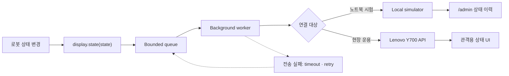
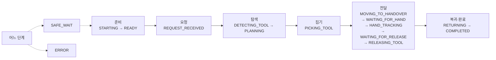

# Orchestra Display Integration

로봇 프로그램이 Orchestra Display에 상태를 보내기 위한 Python 클라이언트입니다.
Lenovo 태블릿이 없을 때 사용할 로컬 수신 서버도 포함합니다.

이 저장소에는 로봇 제어 코드와 Android 앱 소스가 없습니다. 화면 상태 전송만 담당합니다.

## 한눈에 보기

로봇 프로그램은 상태 변경을 큐에 넣고 바로 제어 흐름으로 돌아갑니다. HTTP 전송은 별도 작업 스레드가 처리합니다.



태블릿 응답과 Wi-Fi 연결 상태는 로봇 인식·계획·모션의 성공 조건으로 사용하지 않습니다.

## 준비

- Python 3.10 이상
- 외부 런타임 패키지 없음

```bash
git clone https://github.com/freeskyES/orchestra-display-integration.git
cd orchestra-display-integration
python3 -m pip install -e .
```

## Lenovo 없이 통신 확인

첫 번째 터미널에서 로컬 수신 서버를 실행합니다.

```bash
python3 -m orchestra_display.simulator --port 18080
```

두 번째 터미널에서 상태 전송 예제를 실행합니다.

```bash
python3 examples/send_demo.py --url http://127.0.0.1:18080
```

수신 결과는 브라우저에서 확인합니다.

```text
http://127.0.0.1:18080/admin
```

여기서는 같은 PC의 CVAT가 `8080`을 사용할 수 있으므로 simulator에
`18080`을 명시합니다. WSL의 CuRobo와 함께 시험할 때는 simulator도 같은
WSL에서 실행해야 위 `127.0.0.1` 주소를 그대로 쓸 수 있습니다. Simulator
자체의 기본 포트는 그대로 `8080`입니다.

이 테스트는 요청 형식, 비동기 큐, 상태 순서와 재시도를 확인합니다. 실제 Lenovo 화면과 Wi-Fi 연결은 장비가 준비된 뒤 한 번 더 확인해야 합니다.

## CuRobo에서 설치 없이 사용

CuRobo의 WSL 실행 환경에서는 이 저장소를 `pip install`하거나 별도
subprocess로 실행할 필요가 없습니다. 기존 로봇 실행 명령의 `PYTHONPATH`에
SDK의 `src` 디렉터리만 추가합니다.

```bash
ORCHESTRA_DISPLAY_SRC=/mnt/c/Users/kyuhw/Desktop/work/Robot/orchestra-display-integration/src
PYTHONPATH="${ORCHESTRA_DISPLAY_SRC}${PYTHONPATH:+:${PYTHONPATH}}" \
  python -m zed_obstacle.tool_demo_runtime \
  --tablet-url http://TABLET_IP:8080
```

`--tablet-url`은 CuRobo 연동 코드가 받는 선택적 CLI 값입니다. 같은 값은
`ORCHESTRA_TABLET_URL` 환경 변수로도 전달할 수 있습니다. 이 SDK가 해당 CLI
옵션을 직접 해석하지는 않습니다.
실제 태블릿 주소는 이 값으로 전달하고, SDK 객체는 warm session 시작 시 한
번만 생성해 상태가 바뀌는 지점에서 사용합니다. 로컬 simulator subprocess는
실제 태블릿 운용에 필요하지 않습니다.

문서의 `http://10.77.0.10:8080`은 예시일 뿐 SDK 기본값이 아닙니다. SDK는
Wi-Fi 연결이나 태블릿 IP 탐색을 하지 않으므로, 공유기의 DHCP 예약으로
확인한 실제 주소를 CLI에서 명시해야 합니다.

## 로봇 코드 연동

프로그램 시작 시 한 번 생성합니다.

```python
from orchestra_display import RobotDisplay, RobotState

display = RobotDisplay(
    tablet_url="http://10.77.0.10:8080",
    robot_id="rby1-instrument",
)
```

화면의 의미가 바뀌는 지점에서 상태를 보냅니다.

```python
display.state(RobotState.PLANNING)
display.state(RobotState.PICKING_TOOL, tool="grasper")
display.state(RobotState.MOVING_TO_HANDOVER, tool="grasper")
```

프로그램을 종료할 때 전송 작업을 정리합니다.

```python
display.close()
```

`state()`는 네트워크 전송 완료를 기다리지 않습니다. 반환값이나 태블릿 연결 상태를 로봇 동작 조건으로 사용하지 마세요.

인자 없는 `close()`는 기존과 같이 최대 2초 동안 pending event를 보내려고
시도합니다. 하나의 전체 종료 시간을 직접 지정하려면
`display.close(timeout_s=1.0)`을 사용합니다. Pending display event를 버리고
sender 종료를 요청한 뒤 바로 반환해야 할 때만
`display.close(timeout_s=1.0, drain=False)`를 사용합니다. `close()`는 하나의
caller timeout 안에 종료를 요청하고 반환하지만, 이미 진행 중인 HTTP 호출은
그 뒤에 끝날 수 있습니다. 해당 호출이 반환된 뒤에는 추가 retry 없이 worker가
종료됩니다. 이 호출은 로봇·카메라·gripper cleanup이 끝난 뒤 최외곽 종료
경로에서 실행하세요.

## 주소 변경

로컬 테스트와 Lenovo 연동의 코드 차이는 주소뿐입니다.

| 환경 | 주소 |
|---|---|
| 노트북 내부 테스트 | `http://127.0.0.1:18080` |
| 도구 전달 로봇 Lenovo 예시 | `http://10.77.0.10:8080` |

현장에서는 공유기의 DHCP 예약으로 Lenovo 주소를 고정하고 실제 할당 주소를 설정합니다.

## 상태 코드

상태 코드는 [`contract/states.json`](contract/states.json)에서 관리합니다. 정상 흐름은 다음과 같습니다.



`SAFE_WAIT`는 복구 가능한 안전 대기, `ERROR`는 담당자 확인이 필요한 오류입니다. `READY`, `REQUEST_RECEIVED`, `WAITING_FOR_RELEASE`, `SAFE_WAIT`의 실제 발생 시점은 로봇 동작 정의를 확인한 뒤 확정합니다.

## 구조

```text
src/orchestra_display/
├── client.py       # 로봇 코드가 호출하는 API
├── model.py        # 상태와 이벤트 생성
├── publisher.py    # 큐, 작업 스레드, heartbeat, 재시도
├── transport.py    # HTTP 전송
└── simulator.py    # Lenovo 없는 로컬 수신 테스트
```

각 책임은 인터페이스 경계로 분리되어 있습니다. 테스트에서는 HTTP 대신 가짜 transport를 주입할 수 있습니다.

## 테스트

```bash
PYTHONPATH=src python3 -m unittest discover -s tests -p 'test_*.py'
```

API 전체 명세: <https://freeskyes.github.io/orchestra-display/>
