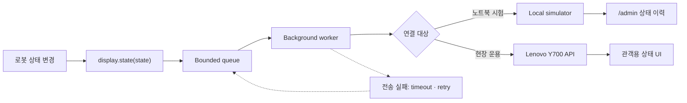
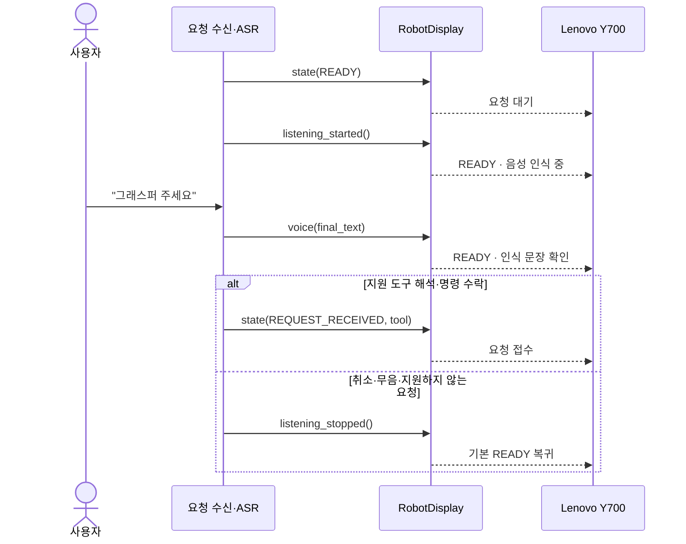
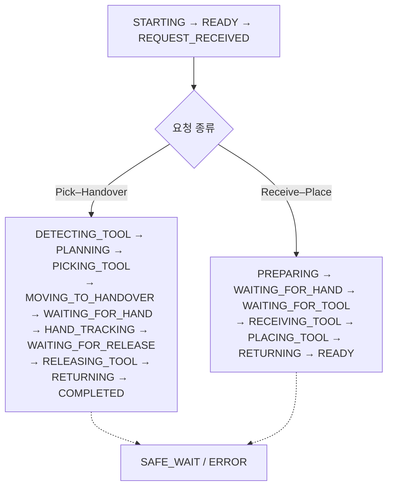

# Orchestra Display Integration

로봇 프로그램이 Orchestra Display에 상태를 보내기 위한 Python 클라이언트입니다.
Lenovo 태블릿이 없을 때 사용할 로컬 수신 서버도 포함합니다.

이 저장소에는 로봇 제어 코드와 Android 앱 소스가 없습니다. 화면 상태 전송만 담당합니다.

## 한눈에 보기

로봇 프로그램은 상태 변경을 큐에 넣고 바로 제어 흐름으로 돌아갑니다. HTTP 전송은 별도 작업 스레드가 처리합니다.



태블릿 응답과 Wi-Fi 연결 상태는 로봇 인식·계획·모션의 성공 조건으로 사용하지 않습니다.

## 준비

- Python 3.10 이상
- 외부 런타임 패키지 없음

```bash
git clone https://github.com/freeskyES/orchestra-display-integration.git
cd orchestra-display-integration
python3 -m pip install -e .
```

## Lenovo 없이 통신 확인

첫 번째 터미널에서 로컬 수신 서버를 실행합니다.

```bash
python3 -m orchestra_display.simulator
```

두 번째 터미널에서 상태 전송 예제를 실행합니다.

```bash
python3 examples/send_demo.py
```

수신 결과는 브라우저에서 확인합니다.

```text
http://127.0.0.1:8080/admin
```

이 테스트는 요청 형식, 비동기 큐, 상태 순서와 재시도를 확인합니다. 실제 Lenovo 화면과 Wi-Fi 연결은 장비가 준비된 뒤 한 번 더 확인해야 합니다.

## 로봇 코드 연동

프로그램 시작 시 한 번 생성합니다.

```python
from orchestra_display import RobotDisplay, RobotState

display = RobotDisplay(
    tablet_url="http://10.77.0.10:8080",
    robot_id="rby1-instrument",
)
```

화면의 의미가 바뀌는 지점에서 상태를 보냅니다.

```python
display.state(RobotState.READY)
display.listening_started()
display.voice("그래스퍼를 회수해줘")
display.state(RobotState.REQUEST_RECEIVED, tool="grasper")
display.state(RobotState.PLANNING)
display.state(RobotState.PICKING_TOOL, tool="grasper")
display.state(RobotState.MOVING_TO_HANDOVER, tool="grasper")
```

음성은 인식 완료 문장 하나만 보냅니다. 오디오, confidence, 중간 인식 결과는
보내지 않습니다. `listening_started()`와 `voice()`가 만드는 화면은 모두 `READY`
내부 substate이며 공식 state는 19개로 유지됩니다. 취소·인식 실패 시에만
`listening_stopped()`로 기본 요청 대기에 돌아갑니다. `REQUEST_RECEIVED`는 ASR
완료가 아니라 지원 도구 해석과 로봇 명령 수락 뒤에 보냅니다.

### 음성 요청 흐름



`voice()` 호출만으로 로봇 동작을 시작하지 않습니다. 요청 계층이 문장을 검증하고
명령을 수락한 뒤 `REQUEST_RECEIVED`를 보낸 다음 기존 runtime을 호출합니다.

Receive–Place도 상태가 바뀌는 지점에서 한 줄씩 호출합니다.

```python
display.state(RobotState.PREPARING)
display.state(RobotState.WAITING_FOR_HAND)
display.state(RobotState.WAITING_FOR_TOOL)
display.state(RobotState.RECEIVING_TOOL)
display.state(RobotState.PLACING_TOOL)
display.state(RobotState.RETURNING)
display.state(RobotState.READY)
```

추가 `workflow` 인자는 없습니다. 앱이 최근 state로 Pick–Handover와 Receive–Place를
자동 구분합니다.

프로그램을 종료할 때 전송 작업을 정리합니다.

```python
display.close()
```

`state()`는 네트워크 전송 완료를 기다리지 않습니다. 반환값이나 태블릿 연결 상태를 로봇 동작 조건으로 사용하지 마세요.

## 주소 변경

로컬 테스트와 Lenovo 연동의 코드 차이는 주소뿐입니다.

| 환경 | 주소 |
|---|---|
| 노트북 내부 테스트 | `http://127.0.0.1:8080` |
| 도구 전달 로봇 Lenovo 예시 | `http://10.77.0.10:8080` |

현장에서는 공유기의 DHCP 예약으로 Lenovo 주소를 고정하고 실제 할당 주소를 설정합니다.

## 상태 코드

19개 상태 코드는 [`contract/states.json`](contract/states.json)에서 관리합니다.
두 정상 흐름은 다음과 같습니다.



`READY`는 로봇 준비 자세와 요청 수신기가 모두 준비됐을 때 또는 정상 복귀 후,
`REQUEST_RECEIVED`는 지원 도구로 해석한 명령을 수락한 뒤 보냅니다.
`WAITING_FOR_RELEASE`는 기존 runtime에 안정적인 인계 대기 신호가 있을 때만 사용하고
없으면 생략합니다. `SAFE_WAIT`는 복구·resume 가능한 명시적 hold에만 사용하며,
원인 불명 또는 종료 예외는 `ERROR`입니다.

화면 컬러는 진행·대기 상태가 초록, `COMPLETED`가 파랑, `SAFE_WAIT`가 노랑,
`ERROR`가 빨강입니다.

## 로봇 개발자 전달 기준

이 저장소의 `main`만 clone해도 SDK 설치, 로컬 simulator, Pick–Handover와
Receive–Place 예제 실행이 가능합니다. 실제 현장 연동에는 다음 외부 정보가 함께
필요합니다.

- Lenovo Y700에 설치된 Orchestra Display `v0.3.0` APK
- Y700의 고정 IP와 API 포트 `8080`
- [API 전체 명세](https://freeskyes.github.io/orchestra-display/)
- 실제 RB-Y1 runtime에서 상태를 보낼 함수 지점

로봇 개발자는 먼저 `examples/send_demo.py`로 Y700 연결을 확인한 뒤, 같은 호출을
기존 runtime의 상태 전환 지점에 옮깁니다. 이 저장소를 로봇 제어 소스와 합치거나
SDK 응답을 모션 조건으로 사용할 필요는 없습니다.

## 구조

```text
src/orchestra_display/
├── client.py       # 로봇 코드가 호출하는 API
├── model.py        # 상태와 이벤트 생성
├── publisher.py    # 큐, 작업 스레드, heartbeat, 재시도
├── transport.py    # HTTP 전송
└── simulator.py    # Lenovo 없는 로컬 수신 테스트
```

각 책임은 인터페이스 경계로 분리되어 있습니다. 테스트에서는 HTTP 대신 가짜 transport를 주입할 수 있습니다.

## 테스트

```bash
PYTHONPATH=src python3 -m unittest discover -s tests -p 'test_*.py'
```

API 전체 명세: <https://freeskyes.github.io/orchestra-display/>
